Python has powerful built-in plotting capabilities with the `matplotlib` library.
For this episode, we will be using the [`seaborn`](https://seaborn.pydata.org/)
package, which is built on top of Matplotlib and interacts well with Pandas.

There are other plotting packages but these are the two most popular.
Another popular one is [`plotnine`](https://plotnine.readthedocs.io/en/), which is inspired by the `ggplot2` plotting library in R.
For some material on this library, you can have a look at the source of this material that uses `plotnine`
[here](https://datacarpentry.org/python-ecology-lesson/07-visualization-ggplot-python.html).

Going back to `seaborn`, just as with the other packages, `seaborn` needs to be imported. Here we will import
both `matplotlib` and `seaborn`. It is good
practice to not just load an entire package such as `from seaborn import *`,
but to use an abbreviation as we used `pd` for Pandas:

~~~
%matplotlib inline
import matplotlib.pyplot as plt
import seaborn as sns
~~~
{: .language-python }

From now on, the functions of `seaborn` are available using `sns.` and matplotlib as `plt.`.
For the exercise, we will use the `surveys.csv` data set, with the `NA` values removed

~~~
import pandas as pd

surveys_complete = pd.read_csv('data/surveys.csv')
surveys_complete = surveys_complete.dropna()
~~~
{: .language-python}

## Plotting with matplotlib/seaborn

The `seaborn` package supports the creation of complex plots from data in a
dataframe. It uses default settings, which help creating publication quality
plots with a minimal amount of settings and tweaking.

Before we use the `seaborn` package, let's just do the simplest plot we can do in Python
using the built-in `matplotlib`. Most plots in matplotlib are based on explicitly passing the arrays for the x-values
and y-values that will make up the points or lines of the plots. For example, to plot the weight versus the hindfoot length
from our surveys data we will need to extract them from the dataframe and pass them to the plotting function:

~~~
plt.scatter(x=surveys_complete["weight"], y=surveys_complete["hindfoot_length"])
~~~
{: .language-python}
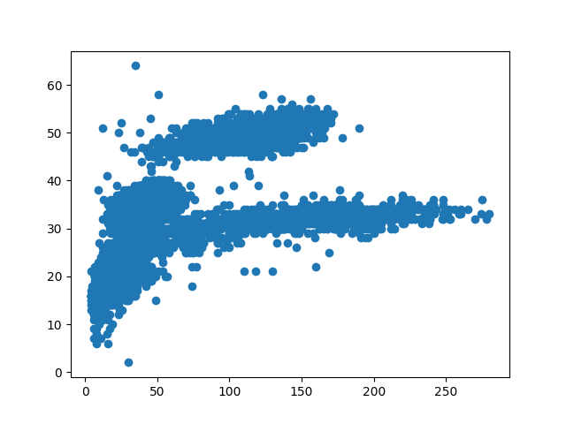

Because `seaborn` integrates well with pandas we can define our data object (the dataframe) and then assign column names to
x and y values of the plot. So the same thing with seaborn is:

~~~
sns.scatterplot(data=surveys_complete, x="weight", y="hindfoot_length")
~~~
{: .language-python}

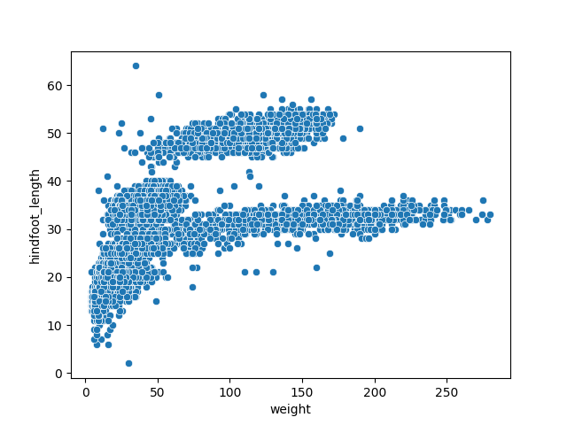

## Building your plots iteratively

Building plots and interactive visualisation is typically an iterative process.
So we would plot something initially but then depending on the results modify various
parameters to, for example, see more clearly what we want.

We start by the same scatterplot we did before:

~~~
sns.scatterplot(data=surveys_complete, x="weight", y="hindfoot_length")
~~~
{: .language-python}

Then, we start modifying this plot to extract more information from it. For
instance, we can add transparency (alpha) to avoid overplotting:

~~~
sns.scatterplot(data=surveys_complete, x="weight", y="hindfoot_length", alpha=0.5)
~~~
{: .language-python}
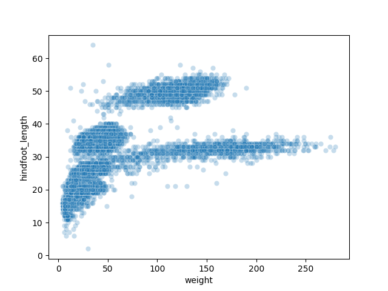

We can also add a different colour for all the points:
~~~
sns.scatterplot(data=surveys_complete, x="weight", y="hindfoot_length", alpha=0.25, color="red")
~~~
{: .language-python}
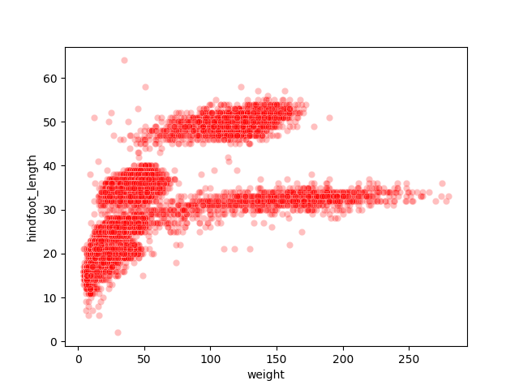

Or to color each species in the plot differently, we can map the `species_id` column to the color (hue):
~~~
sns.scatterplot(data=surveys_complete, x="weight", y="hindfoot_length", hue="species_id", alpha=0.25)
~~~
{: .language-python}

Apart from the adaptations of the arguments and settings of the seaborn plot, additional plot-level elements can be added and controlled as well.
Here, it might be useful to have access to plot-level objects like the axes to set things like axes labels and so on. So we will create a figure and axes object
with the built-in matplotlib so we have access to them and then pass them to seaborn for plotting. We will then use these objects to change the label of the x axis and the legend appearance:

~~~
fig = plt.figure()
ax = fig.add_subplot()
sns.scatterplot(data=surveys_complete, x="weight", y="hindfoot_length",
                alpha=0.5, hue="species_id", ax=ax)
ax.set_xlabel("Weight (g)")
plt.legend(ncol=3)
~~~
{: .language-python}

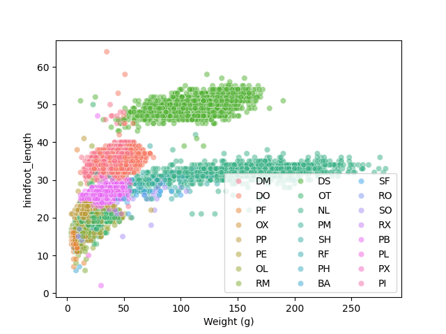

> ## Challenge - Bar plots
> Working on the surveys_complete data set, use the plot-id column to create a bar-plot that counts the number of records for each plot.
> (Check the documentation of the barplot to handle the counts)
> 
> (see in general [API reference](https://seaborn.pydata.org/api.html) to find the appropriate plotting function).
>
> > ## Answers
> >
> > ~~~
> > sns.countplot(data=surveys_complete, x="plot_id", hue="sex")
> > ~~~
> > {: .language-python}
> > 
> {: .solution}
{: .challenge}

## Plotting distributions

Visualizing distributions is a common task during data exploration and
analysis. To visualize the distribution of `weight` within each `species_id`
group, a boxplot can be used:

~~~
sns.boxplot(data=surveys_complete, x="species_id", y="weight")
~~~
{: .language-python}
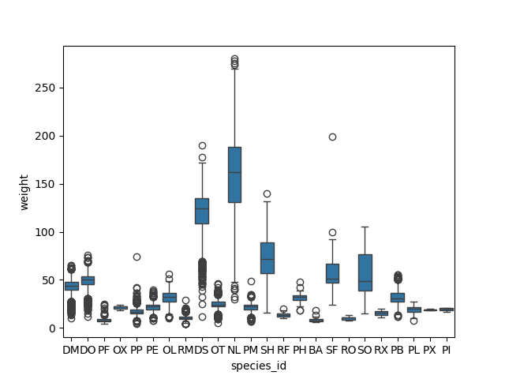

By plotting the points of the individual observations, we can have a
better idea of the number of measurements and of their distribution:

~~~
sns.stripplot(data=surveys_complete, x="species_id", y="weight")
~~~
{: .language-python}
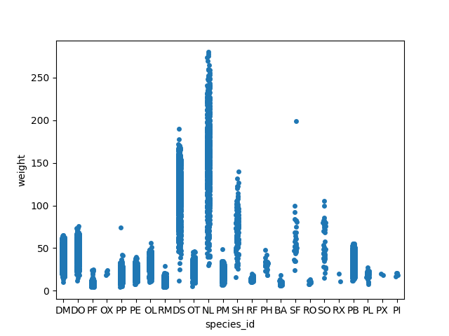

Sometimes boxplots can hide the 'shape' of the distribution. Violinplots can be used instead.
See the full [tutorial](https://seaborn.pydata.org/tutorial/distributions.html)
for plotting distribution data using seaborn including histograms and 2D distributions.

## Plotting time series data

Let's calculate number of counts per year for each species. To do that we need
to group data first and count the species (`species_id`) within each group.

~~~
yearly_counts = surveys_complete.groupby(['year', 'species_id'])['species_id'].count()
yearly_counts
~~~
{: .language-python}

When checking the result of the previous calculation, we actually have both the
`year` and the `species_id` as a row index. We can reset this index to use both
as column variable:

~~~
yearly_counts = yearly_counts.reset_index(name='counts')
yearly_counts
~~~
{: .language-python}

Timelapse data can be visualised as a line plot with years on `x`
axis and counts on the `y` axis.

~~~
sns.lineplot(data=yearly_counts, x='year', y='counts', hue='species_id')
plt.legend(ncol=3)
~~~
{: .language-python}
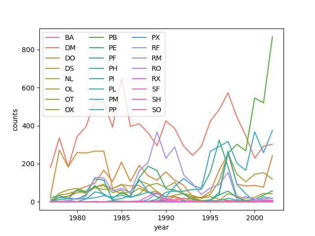

## Faceting

As with other plotting libraries, `seaborn` also has a
special technique called *faceting* that allows to split one plot into multiple
plots based on a factor variable included in the dataset.

Consider our scatter plot of the `weight` versus the `hindfoot_length` from the
previous sections:

~~~
sns.scatterplot(data=surveys_complete, x="weight", y="hindfoot_length")
~~~
{: .language-python}

We can now keep the same code and at the `facet_wrap` on a chosen variable to
split out the graph and make a separate graph for each of the groups in that
variable. As an example, use `sex`:

~~~
sns.relplot(data=surveys_complete, x="weight", y="hindfoot_length",
            col="sex", hue="species_id")
~~~
{: .language-python}

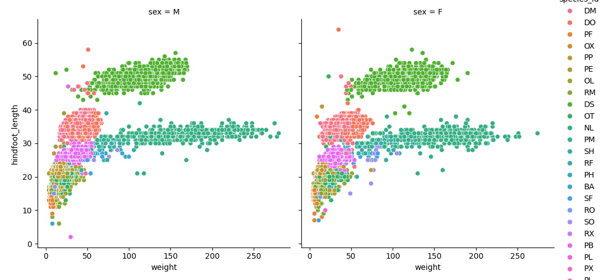

Note that we switched to the `relplot` figure-level function to do the facetting instead of using axis-level functions like
`scatterplot` and `lineplot`.

We can apply the same concept on any of the available categorical variables:
~~~
sns.relplot(data=surveys_complete, x="weight", y="hindfoot_length",
            col="plot_id", hue="species_id", col_wrap=5)
~~~
{: .language-python}

Note that we use the `col_wrap` parameter to wrap the plots to multiple rows.

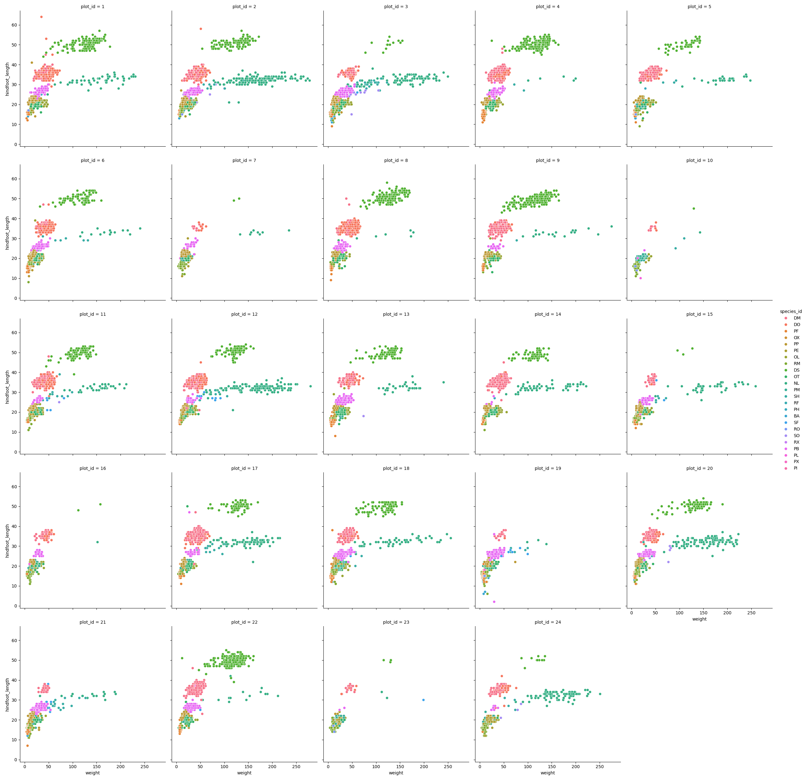

> ## Challenge - facetting
> Create a separate plot for each of the species that depicts how the average
> weight of the species changes through the years.
>
> > ## Answers
> >
> > ~~~
> > yearly_weight = surveys_complete.groupby(['year', 'species_id'])['weight'].mean().reset_index()
> > 
> > sns.relplot(data=yearly_weight, x="year", y="weight",
> >             col="species_id", col_wrap=5, kind="line")
> > 
> > ~~~
> > {: .language-python}
> {: .solution}
{: .challenge}

> ## Challenge - facetting
> Based on the previous exercise, visually compare how the weights of male and
> females has changed through time by creating a separate plot for each sex and
> an individual color assigned to each `species_id`.
>
> > ## Answers
> >
> > ~~~
> > yearly_weight = surveys_complete.groupby(['year', 'species_id', 'sex'])['weight'].mean().reset_index()
> >
> > 
> > sns.relplot(data=yearly_weight, x="year", y="weight", col="species_id",
> >             col_wrap=5, kind="line", hue="sex")
> > 
> > ~~~
> > {: .language-python}
> {: .solution}
{: .challenge}

## Further customization

The plots of seaborn, matplotlib, and other packages in Python can be customised heavily. It takes one look
at the API of your favourite plot function to see the number of parameters it accepts.
Then matplotlib as well on top of that has its own functions to modify its behaviour. In the end, the final look
of the plots is a matter of personal preference or it can be dictated by external factors like publication standards.

Take for example a barchart that plots the counts of surveys per year:
~~~
sns.countplot(data=surveys_complete, x="year")
~~~
{: .language-python}
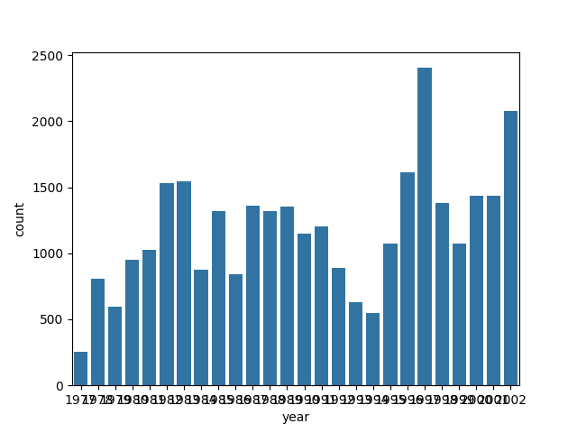

Notice that we use the `year` here as a categorical variable.
However, by doing so, we have the individual year labels overlapping with each other.
Functions in the `matplotlib` axis class provide a way to rotate the text of the x-axis labels:

~~~
fig = plt.figure()
ax = fig.add_subplot()
sns.countplot(data=surveys_complete, x="year", ax=ax)
ax.tick_params(axis='x', rotation=90)
~~~
{: .language-python}

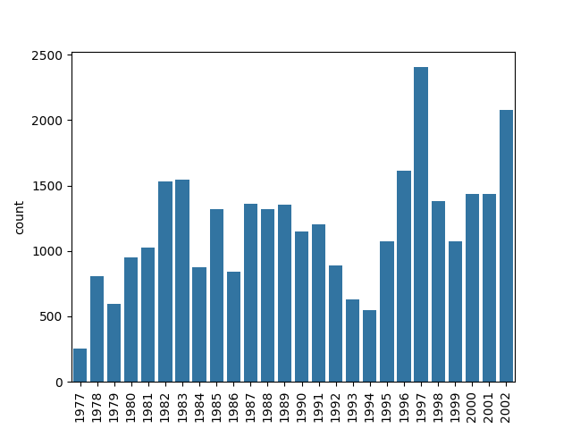

> ## Challenge - customization
> Please take another five minutes to either improve one of the plots
> generated in this exercise or create a beautiful graph of your own.
>
> Here are some ideas:
>
> * See if you can change thickness of lines for the line plot (in the time-series plotting part).
> * Can you find a way to change the name of the legend? What about its labels?
> * Use a different color palette (see <https://seaborn.pydata.org/tutorial/color_palettes.html>)
{: .challenge}

After creating your plot, you can save it to a file in your favourite format.
You can easily change the dimension (and its resolution) of your plot by
adjusting the appropriate arguments when you create the figure object.

~~~
fig = plt.figure(figsize=(3, 2), dpi=300)
ax = fig.add_subplot()
sns.scatterplot(data=surveys_complete, x="weight", y="hindfoot_length", alpha=0.25, hue="species_id", ax=ax)
plt.savefig("scatterplot.png")
~~~
{: .language-python}

[seaborn]: https://seaborn.pydata.org/
[ggplot2-cheat-sheet]: https://www.rstudio.com/wp-content/uploads/2015/08/ggplot2-cheatsheet.pdf
[ggplot2]: https://ggplot2.tidyverse.org
[grammar-of-graphics]: http://link.springer.com/book/10.1007%2F0-387-28695-0
[plotnine-api]: https://plotnine.readthedocs.io/en/stable/api.html#color-and-fill-scales
[plotnine]: https://plotnine.readthedocs.io/en/stable
[setup-plotnine]: https://datacarpentry.org/python-ecology-lesson/setup.html#required-python-packages


